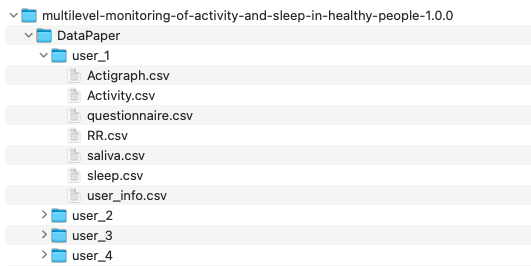

# Data sources
1. Multilevel Monitoring of Activity and Sleep in Healthy People: https://physionet.org/content/mmash/1.0.0/
2. CAP Sleep Database: https://physionet.org/content/capslpdb/1.0.0/

## MMASH

There are 22 folders in the MMASH dataset, and each contains 7 files with the information of the user.

Each user folder contains:

1. `Actigraph.csv`
2. `Activity.csv`
3. `questionnaire.csv`
4. `RR.csv`
5. `saliva.csv`
6. `sleep.csv`
7. `user_info.csv`



```{r}
# read dataset from path
fdpath = "./data/raw/multilevel-monitoring-of-activity-and-sleep-in-healthy-people-1.0.0/DataPaper/" 

# get the list of file names
files <- list.files(path = fdpath) # 22 user folders

# create empty lists to store information
actigraph = data.frame()
activity = data.frame()
questionnaire = data.frame()
RR = data.frame()
saliva = data.frame()
sleep = data.frame()
user_info = data.frame()

# for each user's folder, create data frame for the information with same source and function.
for (i in 1:length(files)) {
  f <- list.files(path = paste0(fdpath,files[i])) # data for each user
  for (fname in f){
    if ('Actigraph.csv' == fname){
      temp = read.csv(paste0(fdpath,files[i],'/',fname), header = T, sep = ",")
      temp['user'] = files[i]
      actigraph = rbind(actigraph, temp)
    }else if('Activity.csv' == fname){
      temp = read.csv(paste0(fdpath,files[i],'/',fname), header = T, sep = ",")
      temp['user'] = files[i]
      activity = rbind(activity, temp)
    }else if('questionnaire.csv' == fname){
      temp = read.csv(paste0(fdpath,files[i],'/',fname), header = T, sep = ",")
      temp['user'] = files[i]
      questionnaire = rbind(questionnaire, temp)
    }else if('RR.csv' == fname){
      temp = read.csv(paste0(fdpath,files[i],'/',fname), header = T, sep = ",")
      temp['user'] = files[i]
      RR = rbind(RR, temp)
    }else if('saliva.csv' == fname){
      temp = read.csv(paste0(fdpath,files[i],'/',fname), header = T, sep = ",")
      temp['user'] = files[i]
      saliva = rbind(saliva, temp)
    }else if('sleep.csv' == fname){
      temp = read.csv(paste0(fdpath,files[i],'/',fname), header = T, sep = ",")
      # user_11 is missing sleep.csv information
      tryCatch(expr = {
        temp['user'] = files[i]
        sleep = rbind(sleep, temp)
        }, error = function(e){
          print(paste0(files[i], " is missing sleep.csv information, having error", e))})
    }else if('user_info.csv' == fname){
      temp = read.csv(paste0(fdpath,files[i],'/',fname), header = T, sep = ",")
      temp['user'] = files[i]
      user_info = rbind(user_info, temp)
    }else{
      next
    }
  }
}

```


refer to the dataset documents, create some ID table.

1. sleeping.
2. laying down.
3. sitting, e.g. studying, eating and driving.
4. light movement, e.g. slow/medium walk, chores and work.
5. medium, e.g. fast walk and bike.
6. heavy, e.g. gym, running.
7. eating.
8. small screen usage, e.g. smartphone and computer.
9. large screen usage, e.g. TV and cinema.
10. caffeinated drink consumption, e.g. coffee or coke.
11. smoking.
12 alcohol assumption. 

```{r}
ID_activity <- data.frame(ID = 1:12, cate = c(
  "sleeping",
  "laying down",
  "sitting",
  "light movement",
  "medium",
  "heavy",
  "eating",
  "small screen usage", 
  "large screen usage", 
  "caffeinated drink consumption",
  "smoking",
  "alcohol assumption" 
))

```

```{r}
# save workplace and variables for later use.
save.image(file = "./data/RData/data_MMASH.RData")
```
## CAP

```{r}

```

